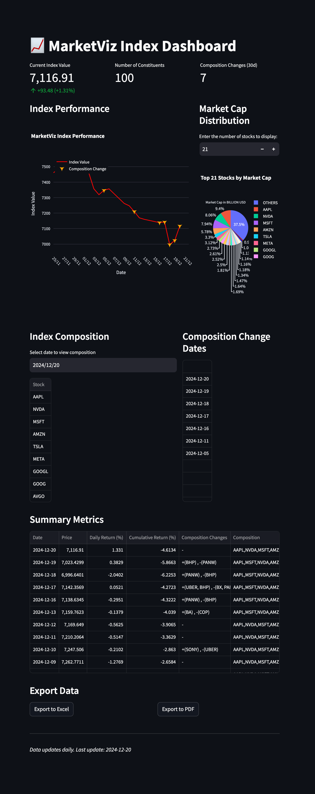

# MarketViz Index

A Python-based ETL system for creating and managing a custom stock market index that tracks top companies by market capitalization. Displayed on a dashboard with insights for intuitive viewing.




## Overview

MarketViz Index Dashboard is a ETL tool that:
- Fetches list of stock tickers from NASDAQ itself (configurable)
- Calculates a custom equi-weighted index based on the top K (=100 here, cofigurable) stocks by market capitalization.
- Stores historical daily index value, daily gains and compositions for the index.
- Provides an interactive dashboard. interface to query index insights for specific dates.
- All insights are available for download in PDF and in xlsx format.

## Key Features

- **Dynamic Stock Universe**: Fetch top US stocks tickers using NASDAQ API
- **Historical Data**: Yahoo Finance API is used for fetching historical prices data. It also gives stock splits data & number of shares data which is used for backcomputing historical number of shares which is used in calculation of Historical Market Cap.
- **Split Adjusted**: Handling Splitting of stocks for calculating shares
- **In-Memory Database for Querying**: Uses SQLite (in-memory mode), once data is feteched it is stored in-memory SQL tables and all subsequent data access and transformations rely on SQL queries.
- **Interactive Dashboard**: Built with Streamlit for real-time visualization
- **Automated Updates**: Daily recalculation of index values and constituents

## Data Source / Silo

### 1. NASDAQ API
- **Purpose**: Fetch current US stock tickers which are listed
- **Functionality used for**: 
  - Retrieves the most recent list of top stocks by market capitalization
  - Provides a configurable input for number of stocks selection
- **Advantages**: 
  - Real-time EOD basis ticker information
  - Direct source from the stock exchange

### 2. Yahoo Finance API (yfinance)
- **Purpose**: Retrieve historical stock data, as well as fundamental data about stock
- **Functionality used for**:
  - Historical stock prices
  - Stock split information
  - Number of outstanding shares
- **Limitations**: 
  - Provides only daily end-of-day (EOD) data
  - Not suitable for intraday or lower timeframe analysis

### 3. SQLite (In-Memory Database)
- **Purpose**: Efficient data storage and querying
- **Functionality used for**:
  - Stores fetched data in-memory
  - Enables fast SQL-based data transformations
  - Temporary storage for the duration of the application
  

## To Run

You have two options to run the application: via Docker or locally.

#### Option 1: Run via Docker

1. Ensure you have Docker and Docker Compose installed on your machine.
2. Navigate to the project directory.
3. Run the following command to build and start the application:
```
docker-compose up --build
```

#### Option 2: Run Locally

1. Clone the repository or download it locally.
2. Create and activate a virtual environment (recommended):
```
python3 -m venv virtualenv_name
source virtualenv_name/bin/activate
```
3. Install dependencies:
```
pip install -r requirements.txt
```
4. Start the Streamlit dashboard:
```
streamlit run app.py
```

&nbsp;

The dashboard will automatically:
- Fetch current market data
- Calculate index values for historical dates
- Display interactive visualizations
- Show index constituents and performance metrics

## Project Structure

```
MarketViz index/
├── app.py                 # Main application entry point
├── src/
│   ├── data/             # Data fetching and SQL lite storage
│   ├── index/            # Index calculation logic
│   └── visualization/    # Dashboard and plotting
├── constants.py          # Configuration constants
└── requirements.txt      # Project dependencies
```

## Challenges/Limitations/Caveats/Assumptions/Notes
- Historical market cap is not available on many of the free APIs (yfinance, Alpha Vantage, IEX); only the current market cap is available. It was observed that data of `current number of shares` & `historical stock splits` was available on the yfinance API (which is free). Therefore, it was leveraged to back-compute the number of shares at each point in time (through the historical split information). Using the formula `MARKET CAPITALIZATION = NUMBER OF SHARES x STOCK PRICE`, we calculated the market cap for each day since we already had access to historical intraday stock price info through yfinance.
- The index lookback window is 1 month, which is short enough that only the top 120-140ish market cap companies will be featured in the top 100-equal_weight index (even after slipping and coming back in the index). So we fetch those tickers for our calculation purposes. (If it were a larger lookback window like 5 years, we would require more accurate data of companies with their market cap at that point in time, which requires access to a good data source, which is almost always not free 🤷)
- If more granularity in data was required, even then access to a good data source would be required; this project only requires daily values to be computed, which was a relief as most free APIs provide daily EOD data. But this method is not scalable to lower timeframes (say 15 min, hourly).
- The constants.py file holds values to control how much data period is to be fetched (currently 1mo) and how much look back is to be displayed on the UI dashboard. Also here we can control how many stocks to fetch; currently, this project is fetching 120 for a 30-day lookback on UI and constructing an index using the top 100. This is done because some may slip in and out of the index over time, and also some may get delisted temporarily.
- Data is stored in memory (in RAM) in SQLite, which means that as soon as the app closes, the data is gone. We could have persisted it on disk, but then it would come with its own set of challenges, to avoid dealing with database configuration and maintenance overhead for this personal project we went on with in memory DB. Also a plus point is In-memory operations are significantly faster than disk I/O, so our intereactive dashboards are faster in views.
- Everything is displayed using Streamlit to a dashboard. There is a slider to view the percentage-wise distribution of companies by market cap among the top 100 ones.
- You get to see on which date what composition was present for the index and what additions and deletions have happened. The composition change dates get separately highlighted. All of these insights are exportable to PDF or XLSX.


&nbsp;
&nbsp;


## Presentation Link

Link : 
https://docs.google.com/presentation/d/1up7ICj-j0BJO7SM2mRafGwRk241KxgYZGOvDxc-YaS0/edit?usp=sharing
